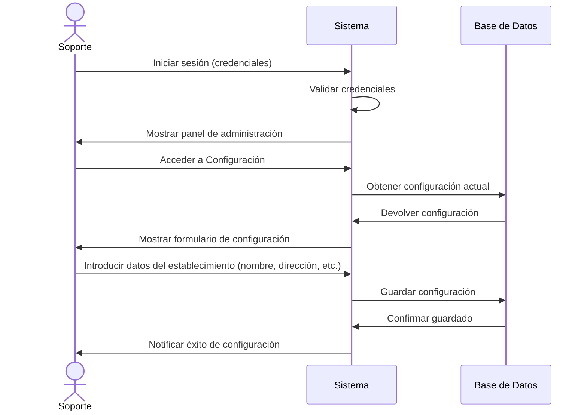
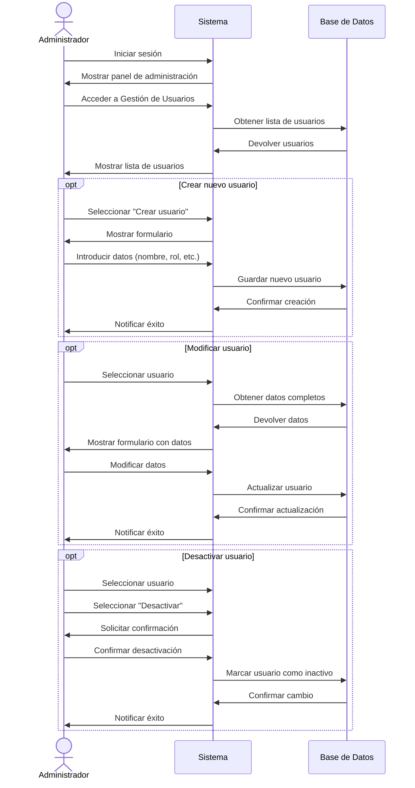
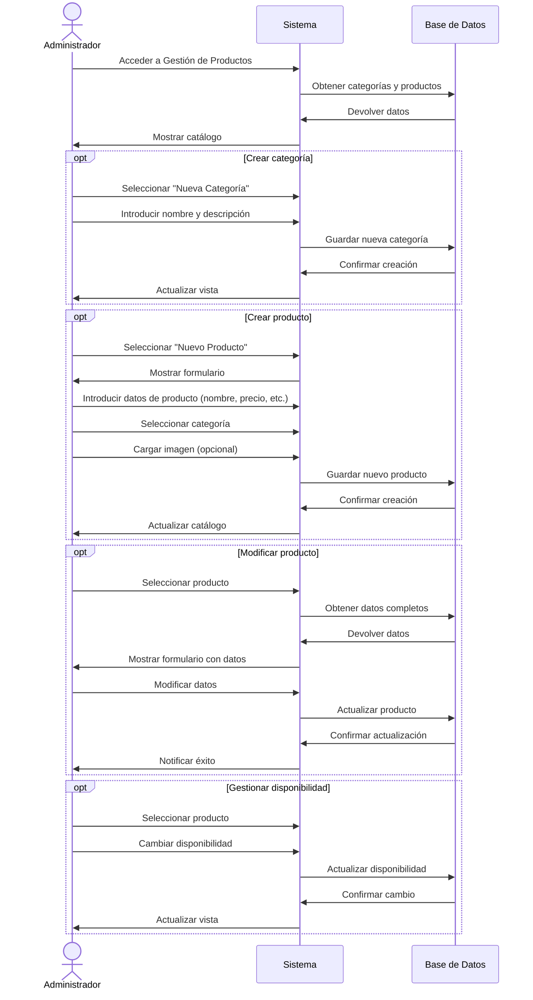
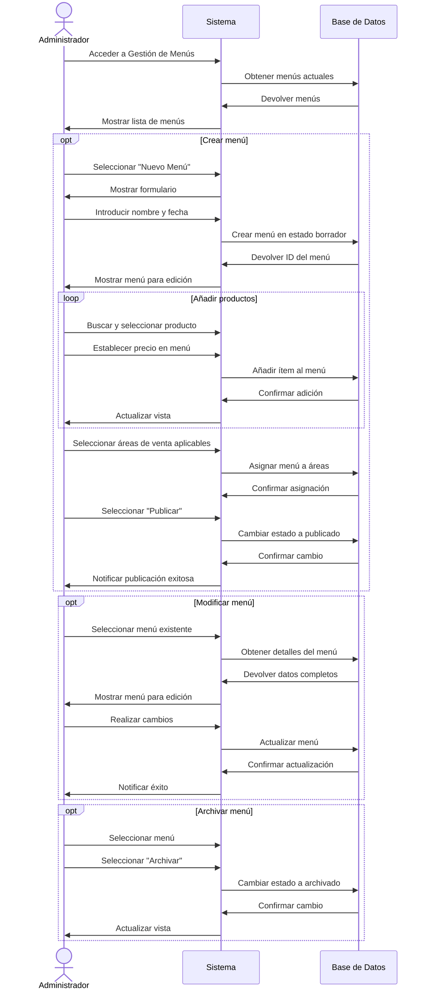
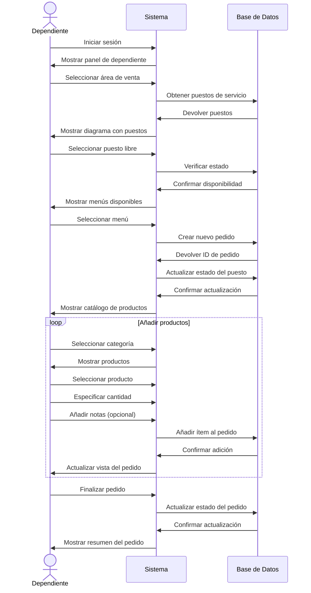
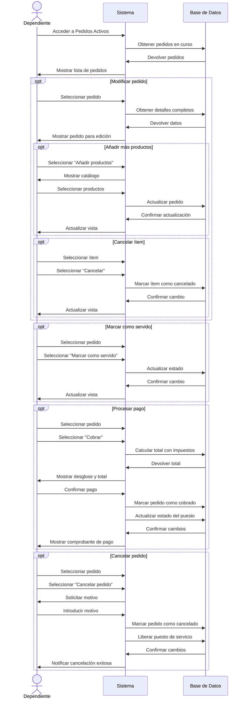
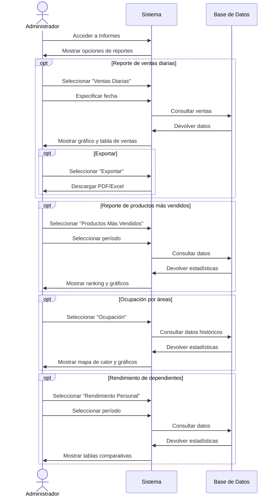
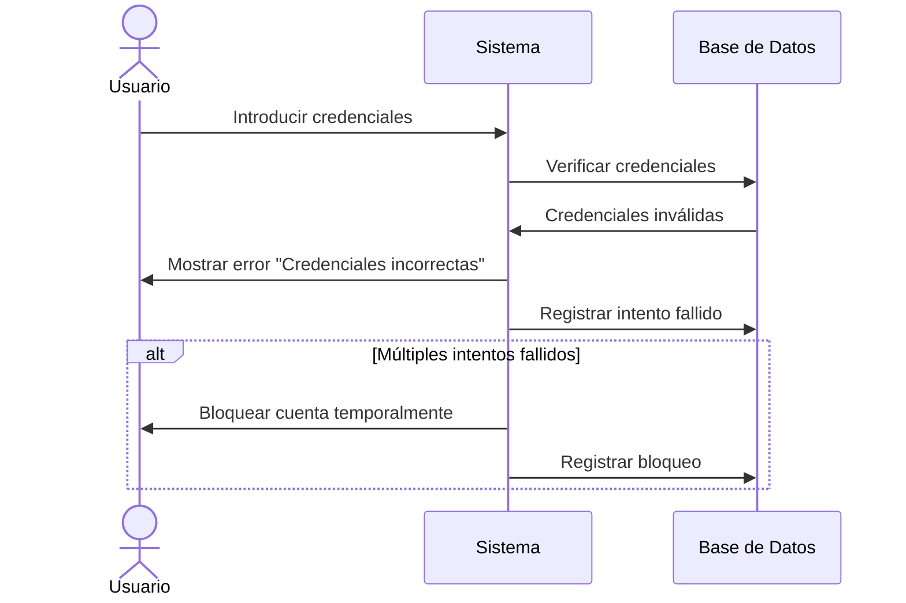
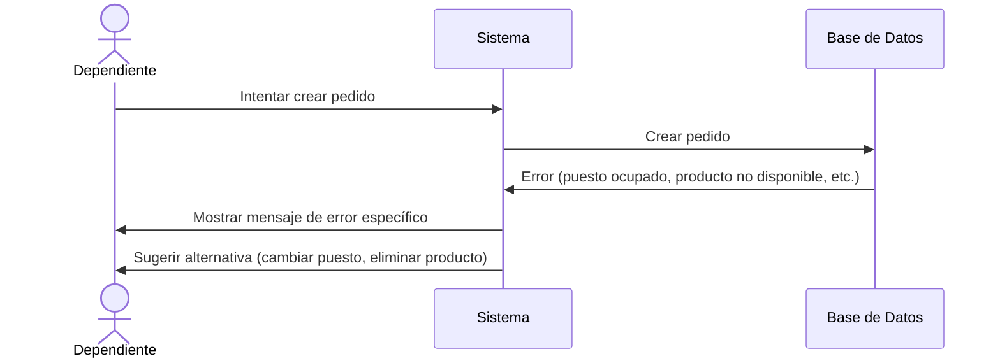

# Vesta Restaurant System - Casos de Uso

Este documento describe los principales flujos de casos de uso del sistema Vesta, organizados por rol de usuario.

## Roles de Usuario

El sistema contempla tres roles principales:

- **Soporte**: Acceso total al sistema, incluida la configuración técnica.
- **Administrador**: Gestión completa del negocio y sus operaciones.
- **Dependiente**: Operación diaria de atención al cliente y gestión de pedidos.

## Flujos de Casos de Uso

### 1. Configuración Inicial del Restaurante (Soporte)

**Actor Principal**: Usuario con rol Soporte
**Objetivo**: Configurar los parámetros iniciales del establecimiento

**Pasos detallados**:
1. El usuario Soporte inicia sesión en el sistema.
2. Accede a la sección de configuración del sistema.
3. Introduce la información básica del establecimiento:
   - Nombre del restaurante
   - Dirección
   - Teléfono
   - Logo
   - Tasa de impuestos aplicable
   - Moneda
4. El sistema guarda la configuración y marca el establecimiento como configurado.
5. El Soporte procede a configurar áreas de venta y puestos de servicio.

### 2. Gestión de Usuarios (Administrador)

**Actor Principal**: Usuario con rol Administrador
**Objetivo**: Crear, modificar o desactivar usuarios del sistema

**Pasos detallados**:
1. El Administrador accede a la sección de gestión de usuarios.
2. El sistema muestra la lista de usuarios actuales.
3. Para crear un nuevo usuario:
   - Selecciona "Crear Usuario"
   - Introduce nombre, apellido, nombre de usuario, contraseña y rol asignado
   - Guarda los cambios
4. Para modificar un usuario:
   - Selecciona el usuario de la lista
   - Modifica los campos necesarios
   - Guarda los cambios
5. Para desactivar un usuario:
   - Selecciona el usuario
   - Selecciona la opción "Desactivar"
   - Confirma la acción

### 3. Gestión de Productos y Categorías (Administrador)

**Actor Principal**: Usuario con rol Administrador
**Objetivo**: Administrar el catálogo de productos

**Pasos detallados**:
1. El Administrador accede a la sección de gestión de productos.
2. El sistema muestra el catálogo organizado por categorías.
3. Para crear una nueva categoría:
   - Selecciona "Nueva Categoría"
   - Introduce nombre y descripción
   - Guarda la categoría
4. Para crear un nuevo producto:
   - Selecciona "Nuevo Producto"
   - Introduce nombre, descripción, precio
   - Selecciona la categoría
   - Opcionalmente carga una imagen
   - Guarda el producto
5. Para modificar un producto:
   - Selecciona el producto del catálogo
   - Modifica los datos necesarios
   - Guarda los cambios
6. Para gestionar disponibilidad:
   - Selecciona el producto
   - Marca o desmarca como disponible
   - Guarda el cambio

### 4. Gestión de Cartas/Menús (Administrador)

**Actor Principal**: Usuario con rol Administrador
**Objetivo**: Crear y gestionar cartas o menús

**Pasos detallados**:
1. El Administrador accede a la gestión de menús.
2. Para crear un nuevo menú:
   - Selecciona "Nuevo Menú"
   - Introduce nombre y fecha de validez
   - Selecciona productos y establece precios específicos para el menú
   - Asigna el menú a áreas de venta específicas
   - Publica el menú cuando esté listo
3. Para modificar un menú:
   - Selecciona el menú a modificar
   - Realiza los cambios necesarios (añadir/quitar productos, cambiar precios)
   - Guarda los cambios
4. Para archivar un menú:
   - Selecciona el menú
   - Elige la opción "Archivar"
   - Confirma la acción

### 5. Toma de Pedidos (Dependiente)

**Actor Principal**: Usuario con rol Dependiente
**Objetivo**: Registrar y gestionar pedidos de clientes

**Pasos detallados**:
1. El Dependiente inicia sesión y accede al panel de atención.
2. Selecciona el área de venta donde se encuentra (salón, barra, etc.).
3. El sistema muestra un diagrama con los puestos de servicio y su estado.
4. Para iniciar un nuevo pedido:
   - Selecciona un puesto libre o reservado
   - Elige el menú aplicable
   - El sistema crea un nuevo pedido y cambia el estado del puesto
5. Para añadir productos al pedido:
   - Navega por las categorías
   - Selecciona productos
   - Especifica cantidad y notas especiales
   - Confirma la adición
6. Finaliza el pedido cuando esté completo.

### 6. Procesamiento de Pedidos (Dependiente)

**Actor Principal**: Usuario con rol Dependiente
**Objetivo**: Gestionar el ciclo de vida de los pedidos activos

**Pasos detallados**:
1. El Dependiente accede a la vista de pedidos activos.
2. Para modificar un pedido:
   - Selecciona el pedido de la lista
   - Añade nuevos productos o modifica cantidades
   - Guarda los cambios
3. Para marcar ítems como servidos:
   - Selecciona el pedido
   - Marca los ítems correspondientes como servidos
   - Confirma el cambio
4. Para procesar el pago:
   - Selecciona el pedido
   - Elige la opción "Cobrar"
   - Verifica el total con impuestos
   - Confirma el pago
   - El sistema genera el comprobante
5. Para cancelar un pedido:
   - Selecciona el pedido
   - Elige "Cancelar"
   - Introduce el motivo de cancelación
   - Confirma la acción

### 7. Reportes y Estadísticas (Administrador)

**Actor Principal**: Usuario con rol Administrador
**Objetivo**: Obtener reportes y estadísticas del negocio

**Pasos detallados**:
1. El Administrador accede a la sección de informes.
2. Para el reporte de ventas diarias:
   - Selecciona "Ventas Diarias"
   - Especifica la fecha o rango
   - Visualiza gráficos y tablas de datos
   - Opcionalmente exporta los datos
3. Para el reporte de productos más vendidos:
   - Selecciona "Productos Más Vendidos"
   - Establece el período de análisis
   - Visualiza el ranking y gráficos
4. Para analizar la ocupación:
   - Selecciona "Ocupación por Áreas"
   - Visualiza mapas de calor y estadísticas
5. Para evaluar el rendimiento del personal:
   - Selecciona "Rendimiento Personal"
   - Establece el período
   - Analiza las estadísticas comparativas

## Flujos de Excepción

### E1. Fallo de Autenticación

### E2. Error en Procesamiento de Pedido

## Notas Adicionales

- Los diagramas de flujo muestran las interacciones principales, pero pueden simplificarse en la implementación real.
- Se recomienda implementar validaciones en cada paso para prevenir inconsistencias.
- El sistema debe mantener logs detallados de las acciones críticas para auditoría.
